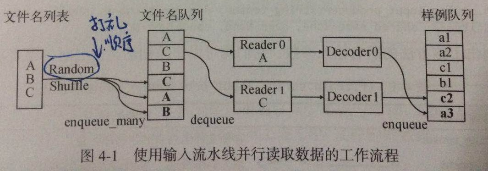
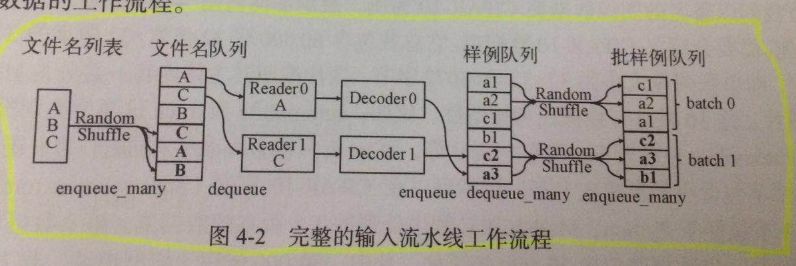

#第四章 Tensorflow的数据处理
Tensorflow 主要涉及三类数据：输入数据集、模型参数、命令行参数  
**这章书里晦涩难懂，大部分是伪代码，后面有时间整理学习**

****
##4.1 输入数据集
典型流程是：文件系统中的输入数据集----读取到内存----转换格式----传入数据流图----开始训练

### 4.1.1 使用流水线并行读取数据
工作流程：  
（1） 创建文件名列表  
（2）创建文件名队伍  
（3）创建Reader和Decoder  
（4）创建样例队伍  
  
   
 
### 4.1.2 创建批样例数据
使用流水线并行读取数据后得到很多样例，需要打包聚合成批数据才能供模型使用。  
tf.train.shuffle_batch方法：创建批数据，同时打包过程打乱样例顺序，增加随机性  

### 4.1.3 填充数据节点
使用填充数据的方法，不需要完整存储数据集，基于输入流水线数据读取、填充，占用内存小、保证数据的实时性  
填充数据节点的方法：在会话中执行session.run时，向其**feed_dict**参数输入符合占位符操作中定义的数据即可  
**feed_dict**参数接受形如<数据节点，填充数据>的Python字典  

### 4.1.4 处理CIFAR-10数据集

### 4.1.4 处理MNIST数据集

****
## 4.2 模型参数
模型参数指模型的权重值和偏置值，即需要训练的对象。
模型参数的使用包括（1）模型的创建、初始化、更新--tf.Variable （2）从模型文件中存储和恢复模型参数--tf.train.Saver  

****
## 4.3 命令行参数
暂缺，后续补充学习

