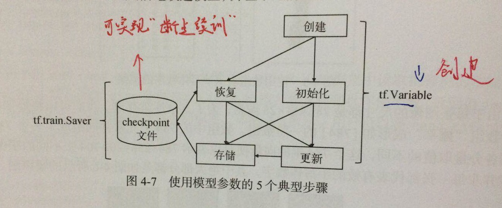
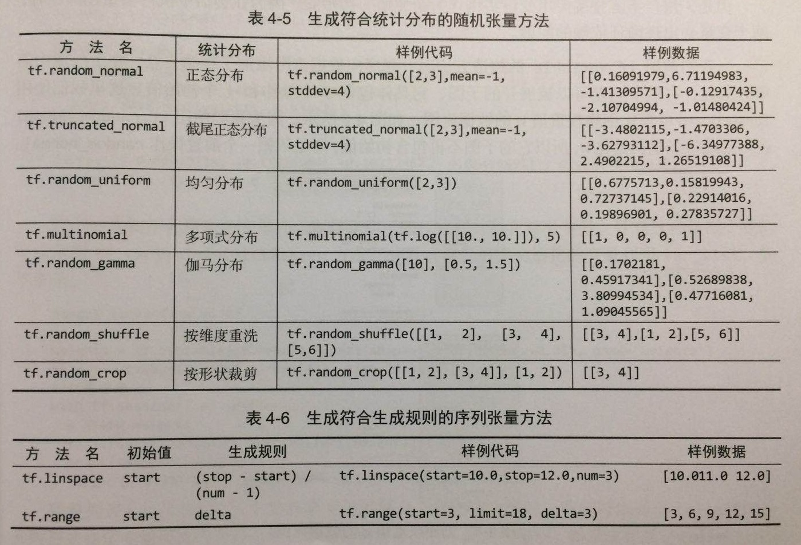
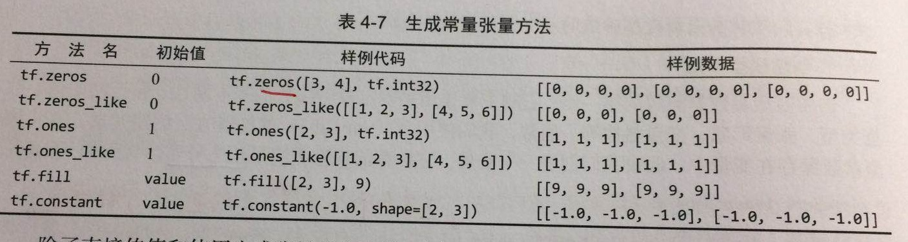

****
## 4.2 模型参数
模型参数指模型的权重值和偏置值，即需要训练的对象。
模型参数的使用包括（1）模型的创建、初始化、更新--tf.Variable （2）从模型文件中存储和恢复模型参数--tf.train.Saver  

  
 
# 4.2.2 使用tf.Variable创建、初始化、更新模型参数
****
(1) 创建模型参数  
使用tf.Variable方法构建变量，并将模型参数保存在变量中，模型参数的属性包括初始值、数据类型、张量形状、变量名称等  
如：   
	W = tf.Variable(initial_value=tf.random_normal(shape=(1, 4), mean=100, stddev=0.35), name = "W")  
	(tf.random_normal方法返回形状为[1,4]的张量，张量的元素符合均值为100，标准差为0.35的正态分布；    
	initial_value参数表示在会话中为变量设置初始值)    
Tensorflow生成张量的方法有：  
  	
   

****
****
(2) 初始化模型参数
变量Variable是存储节点，创建变量仅仅定义了一个“空壳”，因此，**变量必须初始化，将数据以张量的形式传入变量**
在会话的环境中初始化变量
最常用的初始化操作是: tf.global_variable_initializers

****
****
(3) 更新模型参数  
更新模型参数 本质上是对变量中保存的模型参数重新赋值。  
方法有：
(1)直接赋值 tf.assign
(2)加法赋值 tf.assign_add
(3)减法赋值 tf.assign_sub

# 4.2.3 使用tf.train.Saver保存和恢复模型参数
创建saver步骤： 
(1) 创建Saver
(2) 保存为ckpt文件
(3) 训练时恢复保存的变量

# 4.2.4 使用变量作用域处理复杂模型
直接使用tf.Variable创建、初始化、更新模型参数, 数据量庞大，
为此，解决问题的方法有：    
(1) 定义一个存储所有模型参数的Python字典variables_dict, 然后在每次调用时都使用variables_dict的共享参数。   
(2) 使用变量作用域: tf.get_variable & tf.variable_scope 

