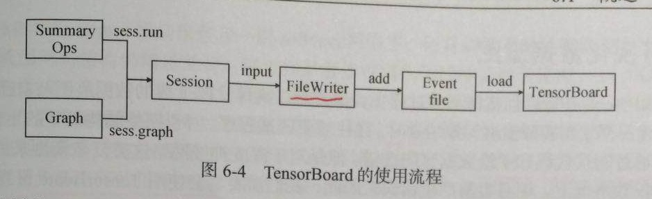
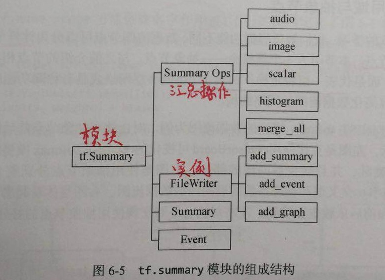
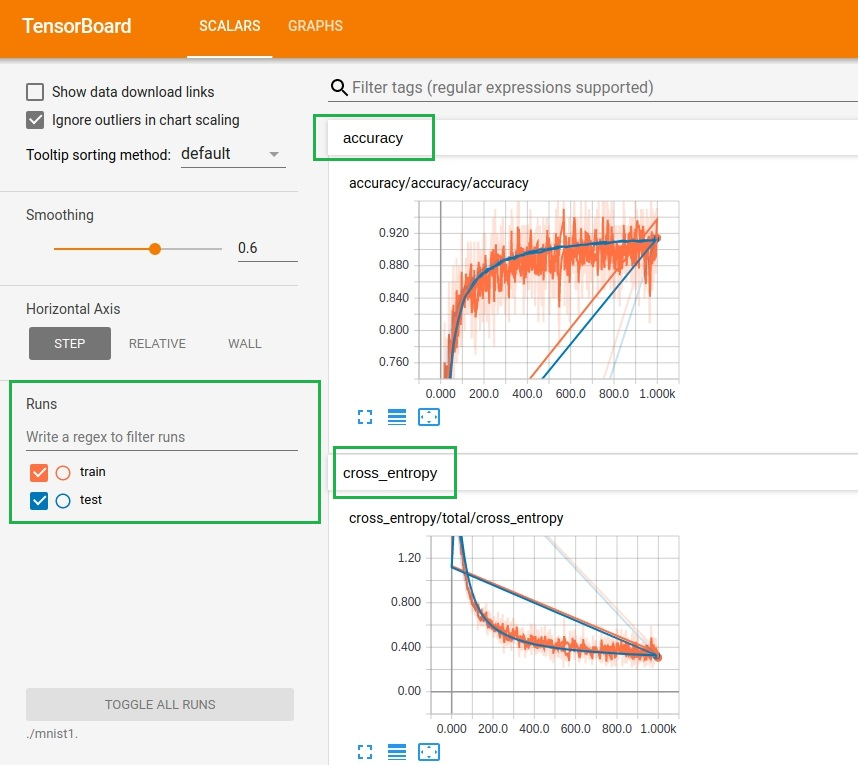
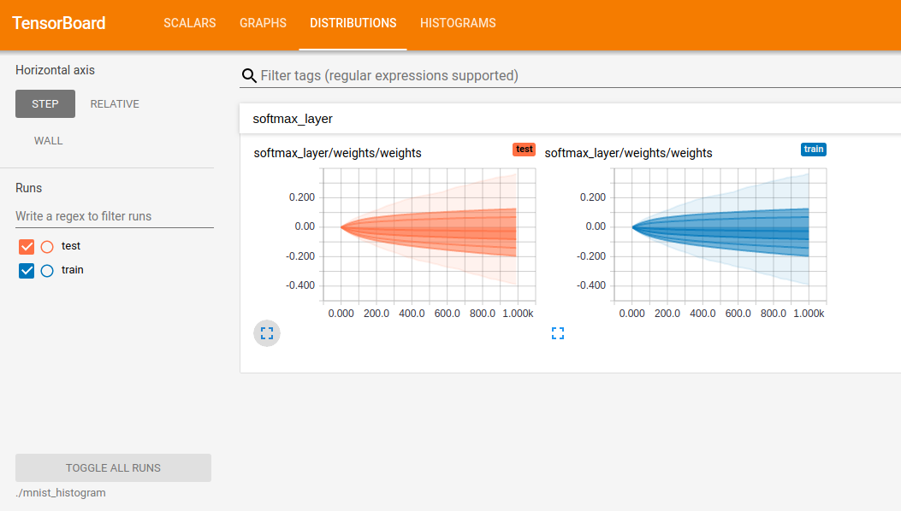
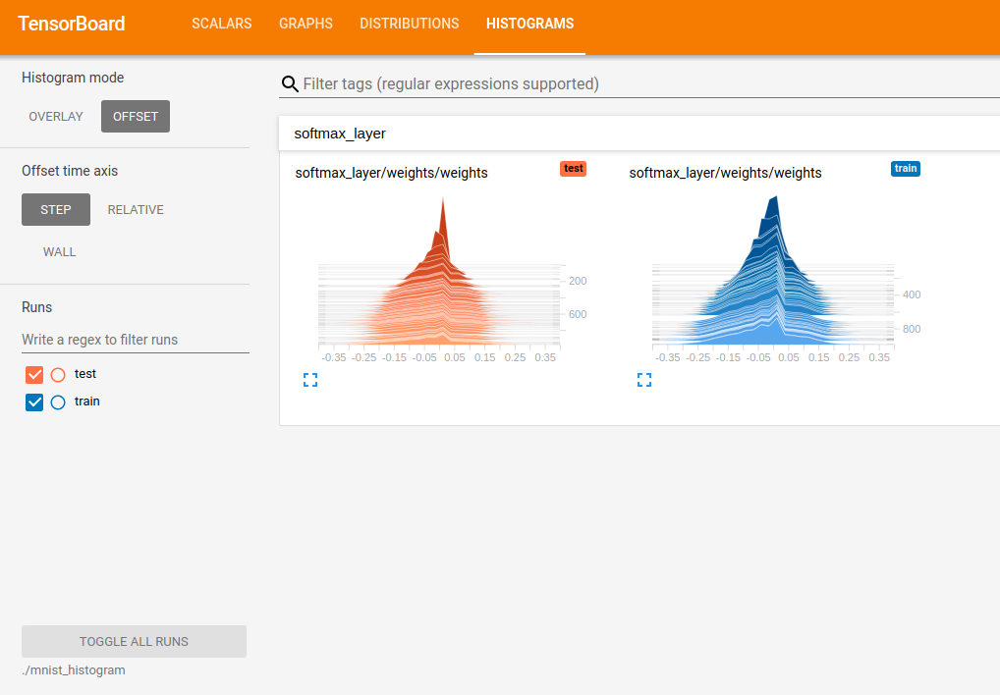
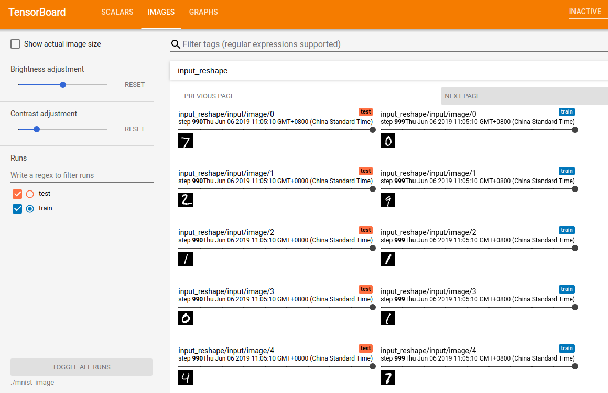
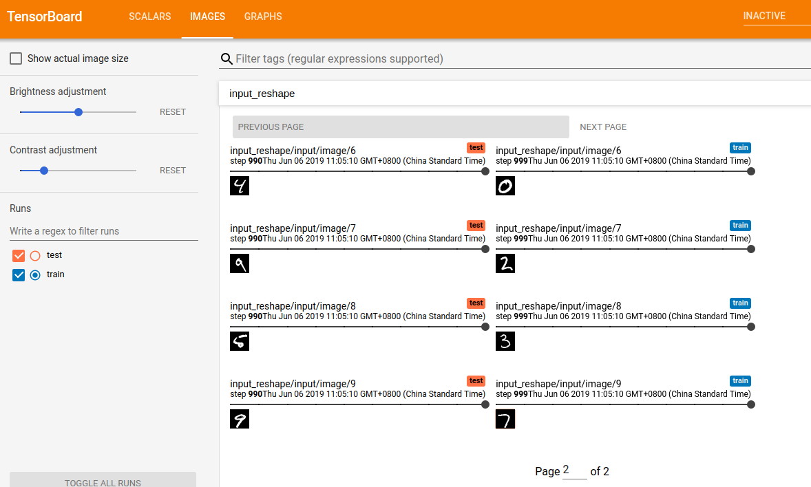
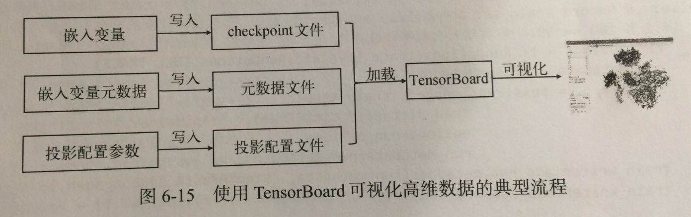

#第六章 TensorBoard
TensorBoard的使用流程：

 其中FileWriter实例和汇总操作summaryopt均属于tf.summary模块


****
## 6.2 可视化数据流图

### 6.2.1 名字作用域与抽象节点
数据流图节点可以分为计算节点、存储节点、数据节点和汇总节点。  
将同一层网络或具有相同功能的操作整合为一个抽象节点，可以简化数据流图的网络结构。  
抽象节点是数据流图上的子图，其内部展开后并没有丢失节点间的扩扑关系。 
**名字作用域** tf.name_scope 定义抽象节点
同一名字作用域下的所有节点继承相同的名字前缀，在数据流图上体现为同一个节点。  

## 6.3 可视化学习过程
### 6.3.1 汇总操作


表 6-3 典型的4种汇总操作
|       操作名称       | 功能说明 |
| :------------------: | :------: |
|  tf.summary.scalar   |   获取一条带有标量值的汇总数据   |
| tf.summary.histogram |   获取一条带有统计值的汇总数据    |
|   tf.summary.image   |   获取一条带有图像的汇总数据    |
|   tf.summary.audio   |   获取一条带有音频的汇总数据   |

### 6.3.2 tf.summary.scalar生成折线图

在会话中执行tf.summary.scalar操作，可以获取一条带有标量值的汇总数据. 

tf.summary.scalar的输入参数有：

|  参数名称   | 功能说明 |
| :---------: | :------: |
|    name     |   生成的汇总节点名称，同时也是TensorBoard中显示的名称       |
|   tensor    |    对应标量值的总量      |
| collections |     汇总操作所属集合的关键字     |

示例代码见6.3.2_mnist_softmax_scalar.py，训练结果生成的折线图如下图所示：


### 6.3.3 tf.summary.histogram生成数据分布图
在会话中执行tf.summary.scalar操作，可以获取一条带有统计值的汇总数据，它的输入参数与tf.summary.scalar类似，分布为:name, values, 和 collections. 
示例代码见6.3.3_mnist_softmax_histogram.py,训练生成的权重数据分布如下图所示:



### 6.3.4 tf.summary.image生成图像
在会话中执行tf.summary.image操作,可以获取一条带有图像的汇总数据.

tf.summary.image的输入参数:

|  参数名称   |                      功能说明                       |
| :---------: | :-------------------------------------------------: |
|    name     | 生成的汇总节点名称，同时也是TensorBoard中显示的名称 |
|   tensor    | 表示图像的四阶张量 ,形如 [batch_size,height,width,channels]|
| max_outputs | TensorBoard渲染图像的最大个数 |
| collections | 汇总操作所诉集合的关键字 |

例:

```
# 将输入图像x转换成四阶张量
image_shape_input = tf.reshape(x,[-1,28,28,1])
# 添加获取手写体图像的汇总操作,设置最大生成10张图像
tf.summary.image('input',image_shape_input,10)
```
示例代码见6.3.4_mnist_softmax_image.py,训练生成的图像如下图所示:  
注: 对test中input_reshape/input/image/0,input_reshape表示该汇总操所属的作用域的名称,input表示该图像的名称,0表示它是这批图像的第一张.



### 6.3.6 可视化MNIST softmax模型
(1)综合使用tf.summary.scalar,tf.summary.histogram,tf.summary.image生成学习过程中准确率和交叉熵的折线图,模型权重值+偏置值的数据分布图和数据统计图,以及输入手写数字图像.   
(2)可视化MNIST softmax模型的数据流图.  
代码见6.3.6_mnist_softmax_best_practice.py

## 6.4 可视化高维数据
高维数据--高维向量  
嵌入向量: 指映射后特征空间中连续且稠密的高维向量.  
在语音识别,图像识别,推荐系统等场景中,通常使用**嵌入向量**来描述客观世界的物体. 嵌入向量不是对物体进行简单编号的结果,而是在尽量保持相似性不变的前提下对物体进行**特征抽象和编码**的产物.   

### 6.4.1 使用TensorBoard可视化高维数据
使用TensorBoard可视化高维数据的典型流程:


```python
# ================(1) 创建嵌入变量,并保存到checkpoint文件
# 嵌入变量是待可视化数据的载体,通常命名为embedding_var(嵌入数据总数,嵌入数据维度)
# eg: 创建嵌入变量,保存测试集中的10000张手写体数字图像
embedding_var = tf.Variable(tf.stack(mnist.test.image[:10000])
                           trainable=False, name='embedding')
# 创建Saver对象,并保存嵌入变量
saver = tf.train.Saver()
saver.save(sess,os.path.join(FLAGS.log_dir+'./model.ckpt'))

# ================(2) 创建嵌入变量元数据,并保存到元数据文件(通常命名为metadata.tsv)
# 嵌入变量元数据:用于描述嵌入变量中每个元素的数据特征集合,通常保存为TSV文件(TSV文件类似与CSV文件,第一行为数据头,第二行是真正的数据)
# TensorBoard还支持切分全景图,然后添加为对应的图像文件 (如从https://www.tensorflow.org/images/mnist_10k_sprite.png下载mnist的全景图,然后从全景图中按顺序裁剪出每一幅图像)

# ================(3) 创建投影配置参数,保存到投影配置文件(通常命名为project_config.pbtxt   )
# 设置embedding的参数,用于指定所使用的嵌入变量及其元数据
embedding {
    tensor_name:"embedding:0"					# tensor_name:嵌入变量名称
    metadata_path:"./embeddings/metadata.tsv"	# metadata_path:元数据文件路径
    # sprite :全景图配置,指定image_path(全景图文件路径)和single_image_dim(长宽像素)
    sprite {
        image_path:"./Pictures_of_Chapter06/mnist_10k_sprite.png"
        single_image_dim: 28
        single_image_dim: 28
    }
}
```

示例代码见6.4_mnist_softmax_embedding.py,MNIST图像数据分类效果如下图所示:
(注:此代码还有一点问题)

