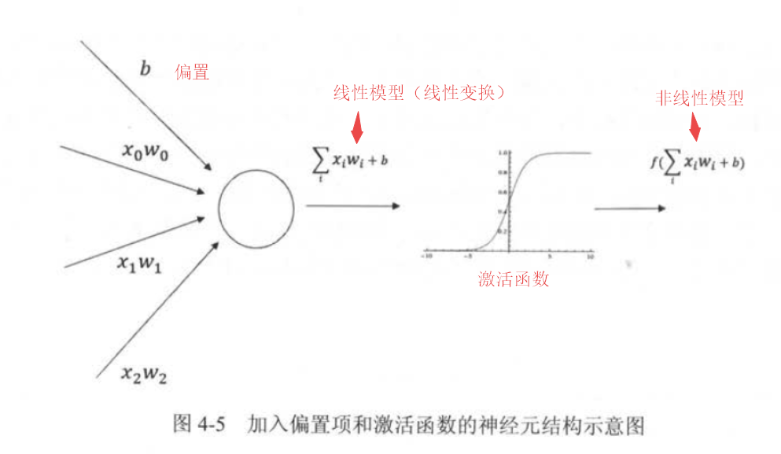
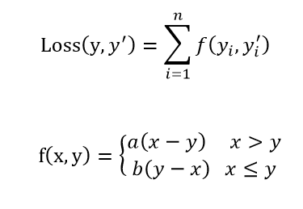
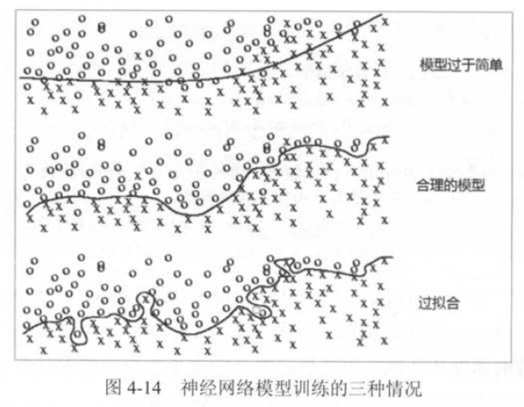

---

---

# 第4章 深层神经网络

## 4.1 神经网络与深层神经网络

### 4.1.1 线性模型

线性模型 (线性变换)
$$
y=∑_iw_i  x_i+b
$$
特点：线性模型的组合仍是线性模型.  所以，只通过线性变换，任意层的全连接神经网络和单层的神经网络的表达能力没有任何区别. 

### 4.1.2 激活函数实现去线性化

神经元的输出通过一个非线性函数，整个神经元模型就不再是线性了，这个非线性函数就是**激活汉化**。



   Tensorflow支持常用的激活函数有ReLU函数(tf.nn.relu)、sigmoid函数(tf.sigmoid)、tanh函数(tf.tanh)。

```python
y = tf.nn.relu(tf.matmul(x, w) + biase)
```

------

## 4.2 损失函数

损失函数是表示神经网络性能的“恶劣程度”的指标。即神经网络对监督数据的拟合程度。

学习时找到最优参数（权重和偏置）--------损失函数取最小值的参数。

### 4.2.1 经典损失函数
cross entropy 交叉熵函数，刻画两个概率分布之间的距离。
```python
cross_entropy = -tf.reduce_mean(
	y_ * tf.log(tf.clip_by_value(y, 1e-10, 1.0)))
# y_: 正确结果, y: 预测结果 
# tf.reduce_mean: 求均值
# tf.clip_by_value()函数可以将一个张量中的数值限制在一个范围内，避免运算错误（如log0无效）
# tf.log()函数对张量中的元素依次求对数
# '*' 指两个矩阵的元素之间直接相乘 ≠ 矩阵乘法(tf.matmul())
```


输出层的激活函数：（1）回归问题----恒等函数；（2）分类问题----softmax函数

Softmax函数将神经网络前向传播得到的结果转化成概率分布。

交叉熵一般与softmax回归一起使用，TensorFlow将这两个功能封装为tf.nn.softmax_cross_entropy_with_logits函数：

```python
cross_entropy = tf.nn.softmax_cross_entropy_with_logits(labels=y_, logits=y)
# y_: 正确结果, y: 预测结果 
```

### 4.2.2 自定义损失函数

如以预测商品销量问题为例：



其中y(i) 为第i个数据的正确答案，y(i)'为神经网络得到的预测值，a 和 b 是常量，在TensorFlow中实现如下：

```python
loss = tf.reduce_sum(tf.where(tf.greater(v1, v2),
							  (v1 -v2) * a. (v2 - v1) * b))
# tf.greater 输入两个张量，比较输入张量中每个元素的大小，并返回比较结果(True/Flase)
# tf.where函数有三个参数，第一个为选择条件根据，当选择条件为True时，tf.where会选择第二个参数中的值；否则使用第三个参数的值
```

具体事例见4.2.2_define_loss.py


------

## 4.2 神经网络优化算法
神经网络的优化过程可以分为两个阶段：
	（1）通过前向传播算法算法计算得到预测值，并将预测值和真实值做对比得出两者之间的差距（loss函数）

​	（2）通过反向传播算法计算损失函数对每一个参数的梯度，再根据梯度和学习率使用梯度下降算法更新每个参数。


**梯度下降算法**有两个问题：只能得到局部最优并不一定达到全局最优+计算时间太长

**随机梯度下降算法** ：在每一轮迭代中，随机优化某一条训练数据上的损失函数，优化速度会大大加快（但是可能无法达到局部最优）

综合梯度下降算法和随机梯度下降算法，实际应用中，每次计算一小部分训练数据（一个batch）的损失函数。

```python
# ======================神经网络优化算法框架=====================
batch_size = n

# 每次读取一小部分数据作为当前的训练数据来执行方向传播算法
x = tf.placeholder(tf.float32, shape=(batch_size, 2), name='x-input')
y_ = tf.placeholder(tf.float32, shape=(batch_size, 1), name='y-input')

# 定义loss 和 优化算法
loss = ...
train_step = tf.train.AdamOptimizer(0.001).minimize(loss)

# 训练神经网络
with tf.Session() as sess:
    ...  
```

  

## 4.4 进一步优化神经网络
学习率、过拟合--正则化、滑动平均  
### 4.4.1 学习率的设置

学习率设置方法----指数衰减法，TensorFlow中使用tf.train.exponential_decay 函数实现


### 4.4.2 过拟合问题----正则化

过拟合：指当一个模型很复杂时，训练模型很好地“记忆”每一个训练数据中随机噪音的部分而忘记学习训练中通用的趋势。


为了避免过拟合问题，常用方法是正则化(regularization)，即在损失函数中加入刻画模型复杂程度的指标，限制权重的大小，使模型不能任意拟合训练中的随机噪音。

常用正则化方法有：**L1正则化**----tf.contrib.layers.l1_regularizer()

​							       **L2正则化**----tf.contrib.layers.l2_regularizer()

```
w = tf.Variable(tf.random_normal([2, 1], stddev=1, seed=1))
y = tf.matmul(x, w)

loss = tf.reduce_mean(tf.square(y_ - y) +
					  tf.contrib.l2_regularizer(lambda)(w))
# lambda参数表示正则化项的权重
# w为需要计算正则化损失的参数
```


### 4.4.3 滑动平均模型

在TensorFlow中使用tf.train.ExponentialMovingAverage()来实现滑动平均


