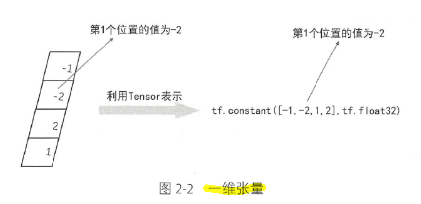
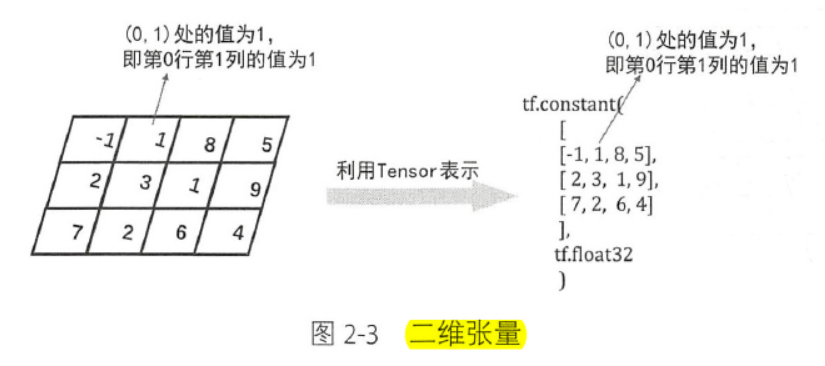
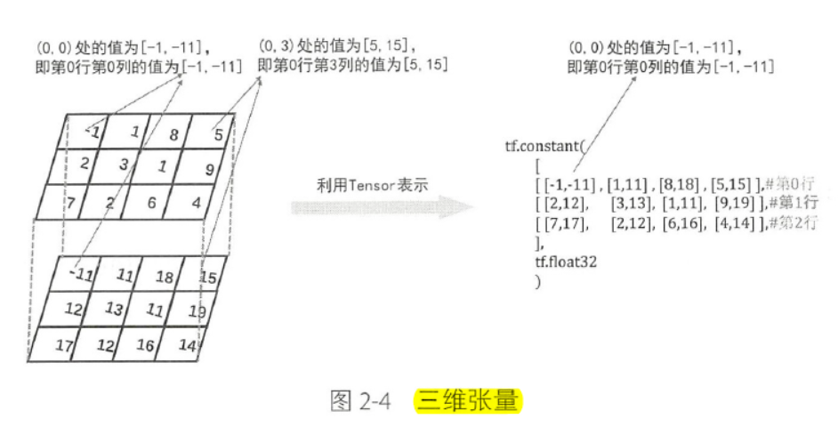
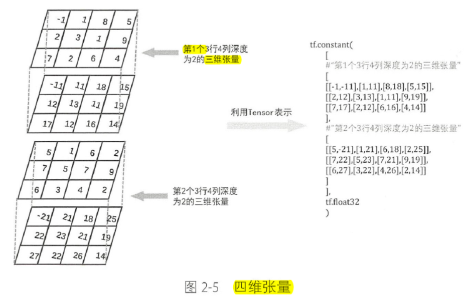

# Chapter02_基本的数据结构及运算

## 2.1 张量

### 2.1.1 张量的定义

张量：n 维数组或矩阵

构造张量：tf.constant(value, dtupe = None, shape = None, Name = "<name>", verify_shape = False)

1. **零维张量**：可以将零维张量理解为**标量**或者**常数**

  ```python
  # 定义常数3
  t = tf.constant(3, tf.float32)
  ```

2. **一维张量**：可以理解为**向量**

  定义长度为4的向量：

  

3. **二维张量**：可以理解为**矩阵**

  定义3行4列的矩阵：
 

3. **三维张量**：可以理解为三维数组 (**多个二维张量在深度方向的组合**)

   定义3行4列2深度的三维张量：

   

4. **四维张量**：可以理解为多个三维张量

   

