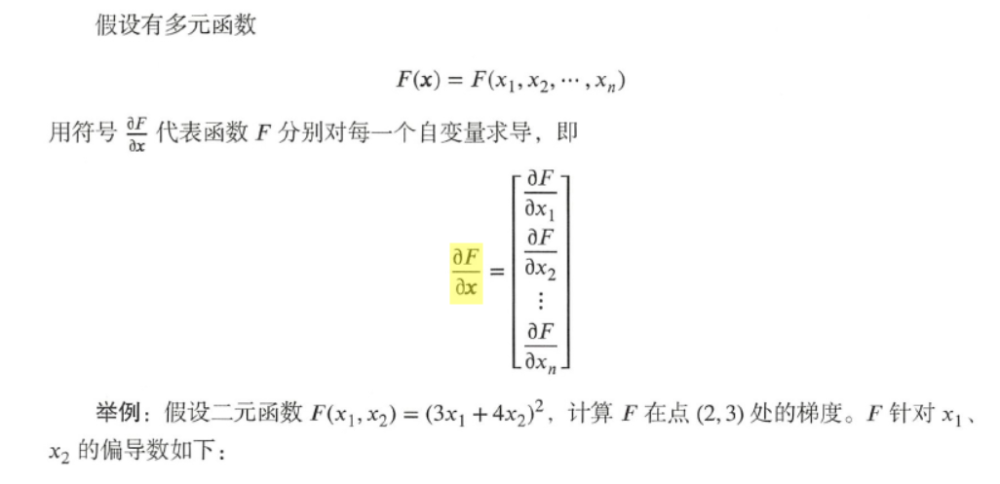
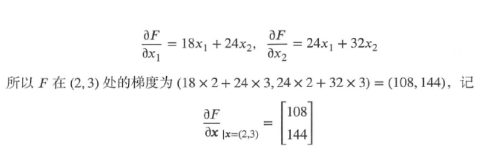
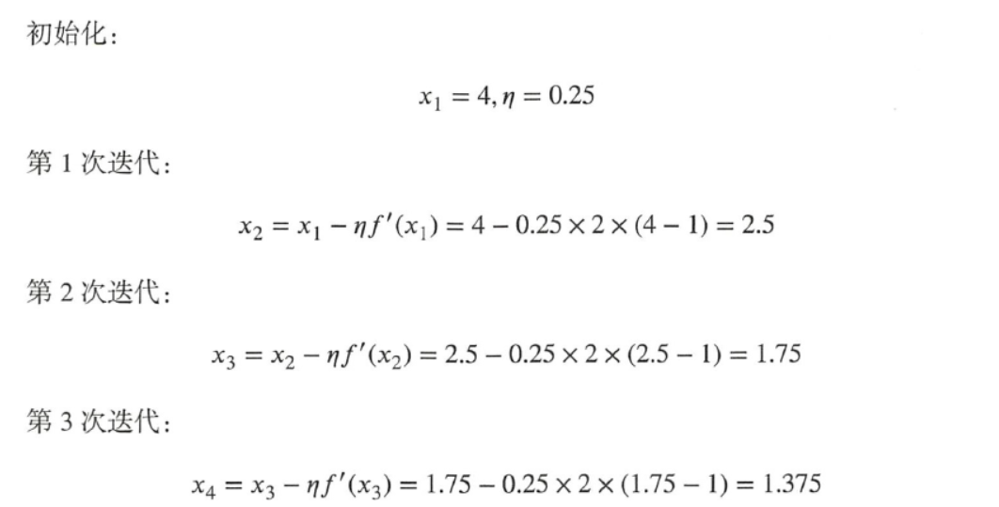
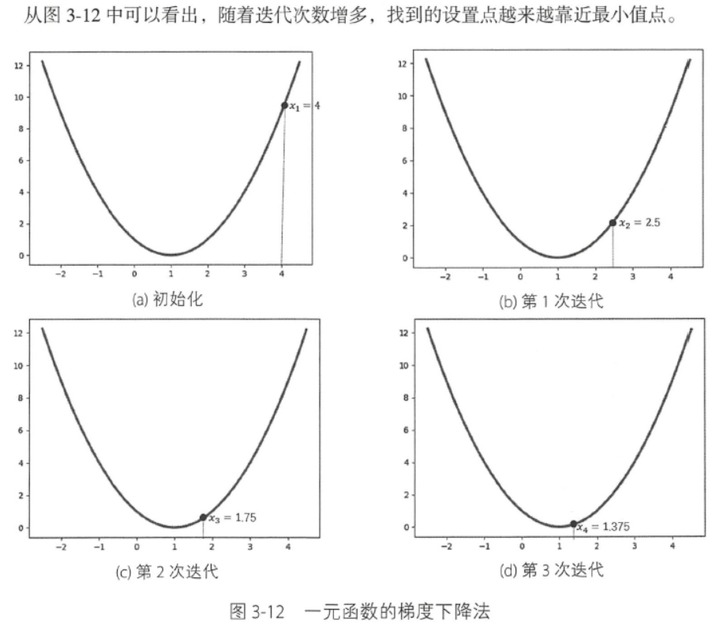
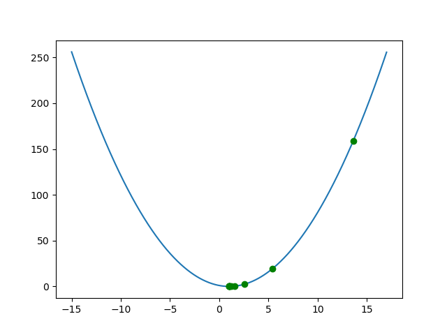
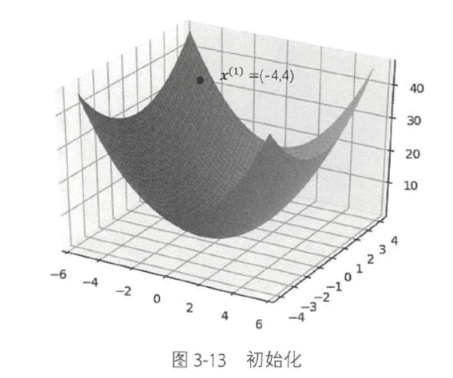
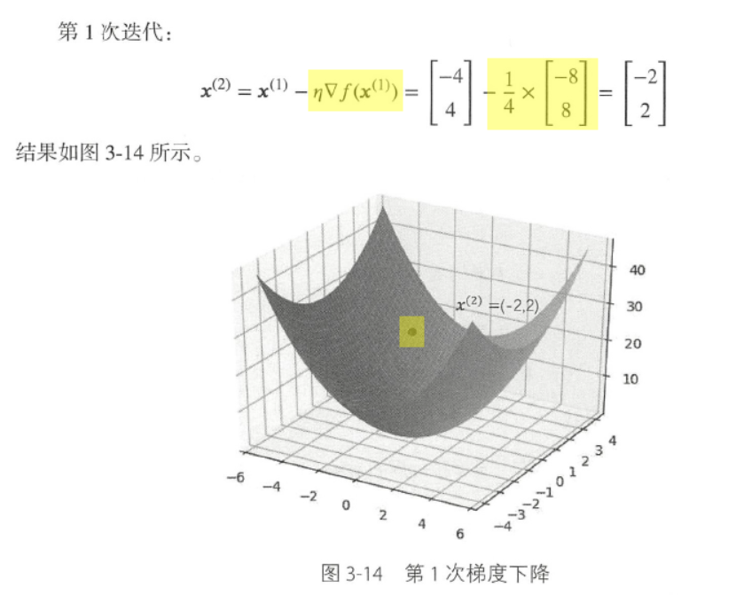
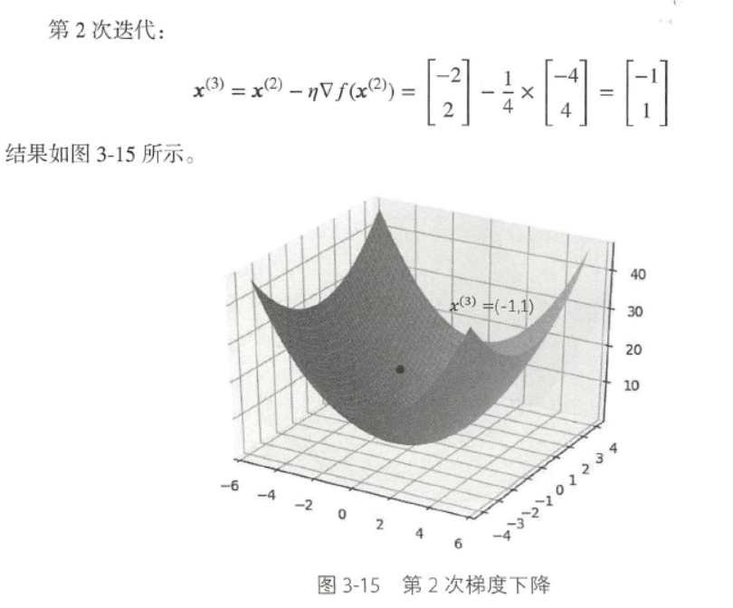

# Chapter03_梯度及梯度下降法

## 3.1 梯度






Tensorflow通过函数 gradients(ys, xs, grad_ys = None, name = "gradient")实现自动计算梯度。

[计算$ F(x_1,x_2)=(3x_1+4x_2)^2$ 在x=(2,3)处的梯度值](./3.1_Gradient.py)


## 3.2 导数计算的链式法则

这节主要介绍了多个函数和的导数、复合函数的导数、驻点、极值点、鞍点。


### 3.2.6 梯度下降法

1. **一元函数的梯度下降法**

求 $f(x) = (x-1)^2$ 的最小值点：





Tensorflow通过函数 tf.train.GradientDescentOptimizer(learning_rate, use_locking=False, name="GradientDescent") 实现梯度下降法。

用该函数实现以上示例的迭代过程的代码(完整代码见[3.2.6_1_GradientDescent.py](3.2.6_1_GradientDescent.py))：

```python
x = tf.Variable(4.0, dtype=tf.float32)
y= tf.pow(x-1, 2.0)

# 梯度下降，学习率设置为0.25
optimizer_1 = tf.train.GradientDescentOptimizer(0.25).minimize(y)

with tf.Session() as sess:
    sess.run(tf.global_variables_initializer())
    for i in range(3):
        sess.run(optimizer_1)
        # 打印每次迭代后x的值
        print(sess.run(x))       
'''
2.5
1.75
1.375
'''
```

打印的结果与手动计算的结果一致，但是在实际计算中，学习率设置为0.25太大了，现在修改学习率为0.05，迭代100词，每10词打印结果，代码见：[3.2.6_2_GradientDescent .py](./3.2.6_2_GradientDescent .py)， 用matplotlib.pyplot画出这些点如图所示：



有结果可知，随着迭代次数的增加，找到的位置越来越靠近最小值点x=1。


2. **多元函数的梯度下降法**

对二元函数 $f(x_1,x_2)=x_1^2+x_2^2$ 的最优化问题，使用梯度下降法：

- 初始化 ：
  $$
  x^{(1)=(-4,4)}, \eta=0.25
  $$
  

- 第一次迭代

  

- 第二次迭代

  

使用Tensorflow实现上诉迭代过程(详细代码见[3.2.6_3_GradientDescent2.py](3.2.6_3_GradientDescent2.py))：

```python
# 二元函数 f(x_1,x_2)=x_1^2+x_2^2 使用梯度下降法最优化，初始值x^{(1)=(-4,4)}, 学习率设置为0.25
x = tf.Variable(tf.constant([-4,4],tf.float32), dtype=tf.float32)

y= tf.reduce_sum(tf.square(x))

# 梯度下降，学习率设置为0.25
optimizer_1 = tf.train.GradientDescentOptimizer(0.25).minimize(y)

with tf.Session() as sess:
    sess.run(tf.global_variables_initializer())
    
    for i in range(2):
        sess.run(optimizer_1)
        # 打印每次迭代后x的值
        print(sess.run(x))
        
'''
[-2.  2.]
[-1.  1.]
'''
```


## 3.3 梯度下降法

这节介绍了几种常用的梯度下降法的原理和实例，有Adagrad法、Momentum法、NAG法、RMSprop法、具备动量的RMSprop法、Adadelta法、Adam法、Batch梯度下降、随机梯度下降、mini-Batch梯度下降。

具体细节等深入学深度学习的时候再补充笔记。