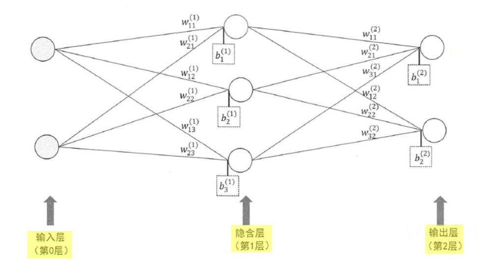

# Chapter05_全连接神经网络

## 5.1 基本概念

这部分详细内容见参考关于感知机和神经网络的笔记：[感知机和神经网络.md](./感知机和神经网络.md)

使用Tensorflow计算如下所示两层全连接神经网络：



**输入层到隐含层的计算过程：**
$$
x = [x_1,x_2] = [3,5]
$$

$$
\begin{equation}\begin{split} 
w^{(1)} & = \begin{bmatrix} w_{11}^{(1)} & w_{12}^{(1)} & w_{13}^{(1)}\\  w_{21}^{(1)} & w_{22}^{(1)} & w_{23}^{(1)}\\ \end{bmatrix}  \\
    & = \begin{bmatrix} 1 & 4 & 7\\  2 & 6 & 8\\ \end{bmatrix}
\end{split}\end{equation}
$$

$$
b^{(1)} = [b_1^{(1)},b_2^{(1)},b_3^{(1)}] = [-4,2,1]
$$

输入x在隐含层的线性组合：
$$
\begin{equation}\begin{split} 
l^{(1)} & = xw^{(1)}+b^{(1)}  \\
      & =  [3,5] \begin{bmatrix} 1 & 4 & 7\\  2 & 6 & 8\\ \end{bmatrix} + [-4,2,1] \\
      & = [9,44,62]
      
\end{split}\end{equation}
$$
激活隐含层：
$$
\sigma^{(1)} = f(l^{(1)}) = 2 * l^{(1)} = [18,88,124]
$$
隐含层到输出层的计算过程与上面类似，不具体计算了，在TensorFlow中实现如下：(详细代码见[5.3.1_two_layer_nn.py](./5.3.1_two_layer_nn.py))

```python
# 输入层和输出层
x = tf.placeholder(tf.float32,shape=(1,2),name = "inmput")
y = tf.placeholder(tf.float32,shape=(1,2),name = "outmput")

# 第一层的权重
w1 = tf.constant(
    [[1,4,7],
     [2,6,8]
    ],tf.float32
    )
# 第一层的偏置
b1 = tf.constant(
    [
    [-4,2,1],
    ],tf.float32
    )
# 计算第一层的线性组合
l1 = tf.matmul(x,w1)+b1
# 激活第一层
sigmal1 = 2 * l1

# 第二层偏置
w2 = tf.constant(
    [
    [2,3],
    [1,-2],
    [-1,1]
    ],tf.float32
    )
#第二层偏置
b2 = tf.constant(
    [
    [5,-3]
    ],tf.float32)
# 计算第二层的线性组合
l2 = tf.matmul(sigmal1,w2)+b2
# 激活第二层
sigmal2 = 2*l2

with tf.Session() as sess:
    y = sess.run(sigmal2,feed_dict = {x:np.array([[3,5]],np.float32)})
    print(y)
# [[10. -2.]]
```

上面程序实现的是一个输入的情况，可以小改一下，就可以实现计算多个输入分别输出对应的输出。

如假设有4个输入 (用矩阵管理多个输入，其中每一个**输入按行存储**)：
$$
x = \begin{bmatrix} 10 & 11 \\  20 & 21 \\  30 & 31 \\ 40 & 41 \end{bmatrix}
$$
计算上诉两层神经网络后的输出结果用TensorFlow实现为：(详细代码见[5.3.1_two_layer_nn_mul_input.py](./5.3.1_two_layer_nn_mul_input.py))

```python
# 输入层和输出层
x = tf.placeholder(tf.float32,shape=(None,2),name = "inmput")
y = tf.placeholder(tf.float32,shape=(None,2),name = "outmput")

# ...(参数设置与上面程序相同)

with tf.Session() as sess:
    y = sess.run(sigmal2,feed_dict = {x:np.array([[10,11],
                                                  [20,21],
                                                  [30,31],
                                                  [40,41]],np.float32)})
    print(y)
'''
[[ 30. 102.]
 [ 70. 262.]
 [110. 422.]
 [150. 582.]]
 '''
```


## 5.4 激活函数

这节主要讲解了常用的激活函数：

**隐含层**常用的激活函数

| 激活函数 | 调用方式                        | 使用 |
| -------- | ------------------------------- | ---- |
| sigmoid  | tf.nn.sigmoid(x, name=None)     |      |
| tanh     | tf.nn.tanh(x, name=None)        |      |
| ReLU     | tf.nn.relu(features, name=None) |      |

输出层常用的激活函数

| 激活函数             | 调用方式 | 使用                                   |
| -------------------- | -------- | -------------------------------------- |
| 恒等函数 $y_k = a_k$ |          | 用于回归问题                           |
| softmax函数          |          | 用于分类问题，输出是0~1的实数，总和为1 |
|                      |          |                                        |

