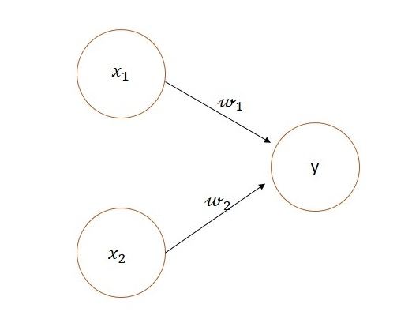
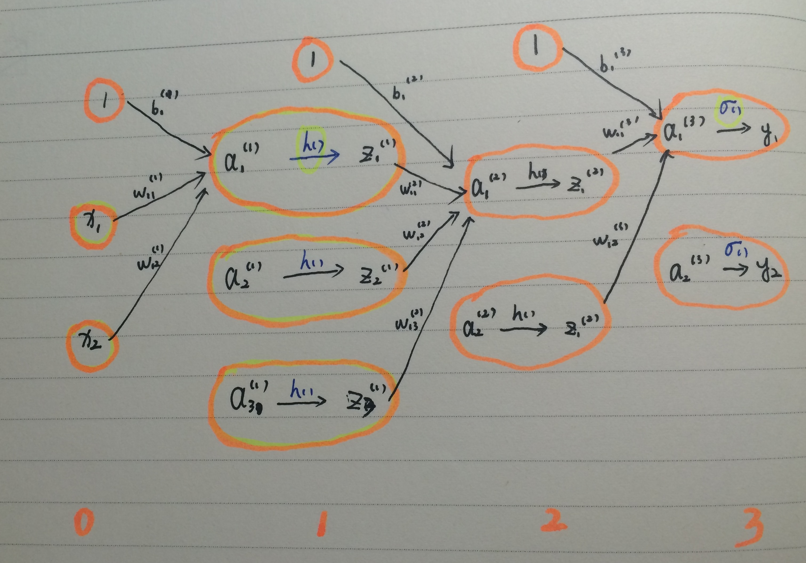

# 感知机和神经网络

## 01 感知机

感知机接收多个输入信号，输出一个信号。

一个接收两个输入信号的感知机：

表达为数学表达式为：
$$
y=
\begin{cases}
&0  \ \ \   (w_1x_1+w_2x_2\le\theta)		\\
&1  \ \ \   (w_1x_1+w_2x_2\gt\theta)		\\
\end{cases}
$$
其中，$x_1,x_2$ 是输入信号，$y$是输出信号，$w_1,w_2$ 是权重，$\theta$ 是阈值

感知机的具体用途和缺陷待补充。。。

## 02 神经网络

三层神经网络：

具体细节待补充

----

**参考链接**

1. 博客：[神经网络浅讲：从神经元到深度学习](<https://www.cnblogs.com/subconscious/p/5058741.html>)

2. 斋藤康毅 著《深度学习入门--基于Python的理论与实现》第二章 感知机
3. 斋藤康毅 著《深度学习入门--基于Python的理论与实现》第三章 神经网络
4. 张平著《图解神经网络与深度学习》